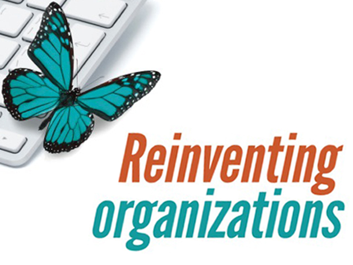

## The craftsman's role in a Teal Organization

  Alvaro Garcia (@alvarobiz)
==V

## About me

  * Alvaro Garcia (@alvarobiz)
  * Craftsman at Codurance
  * Learner 
==>

## Contents

  * The Teal organization
    * Examples
    * Characteristics
    * What defines it?
    * Opposing views
  * The craftsmen
    * Fluid roles
    * Decide your own career
    * Development & Business partnership 
  * Sources
==V

## Example Teal Orgs
  * [Valve](http://www.valvesoftware.com) (software)
  * [Morning star](http://morningstarco.com/) (tomato processing)
  * [Patagonia](http://eu.patagonia.com/) (outdoor clothing)

Note: Valve produces software games and related products. Produces Steam, and the store ecosystem.  Note: Morning star, not to be confused with a finance group Note: Patagonia, outdoor clothing and gear for outdoorsy people. Their purpose goes beyond producing clothing.  Note: the first one, I've deduced they have some teal practices based on their employee handbook. The rest are cited in the book:
==V

# The Teal organization
==V

Reinventing Organizations by Frederic Laloux
==V

## Characteristics (I)
  * Principles:
    * Wholeness
    * Self-management
    * Evolutionary purpose

Note: 
* Wholeness: how the people, team, company relates to its environment.
* self-management: organization without a permanent leader. no job descriptions
* purpose: not being tied to a single purpose makes it easier.
==V

## Characteristics (II)
  * Metaphor: living organism

Note: 
* Comparison: Achievement-Orange: machines, Pluralistic-Green as families, Teal organizations as living organisms or living systems.
* changing and morphing in response to the needs and constraints it encounters as it tries to serve its purpose as much as possible.
==V

## Characteristics (III)
  * Small orgs
  * ~Skunk works
  * Staff functions

Note:
* Small orgs, at least around you. There can be miniorgs (8-10-12 people), but hundreds of them.
* Staff functions (HR, finance, risk, ...) usually done by front-line teams, with exceptions: hired hands, central support staff without top-down authority
==V

## Opposing views (for the book)

  * Questioning Laloux views and basis
  * Research in opposite direction
  * Hand-picked case studies
  * Bias - author's ideology
==>

## Do craftsmen fit in a Teal organization?
Note: all of what I've explained has no relationship with craftsmanship. How does all of this affect us? What can we do get the most of it?
==V

## Fluid roles
  * Find time for *developer tasks* that are not **programming**:
    * Hiring
    * Analysis
    * Leadership
    * Coaching, mentoring
  * Not a punishment, but voluntary

Note: 
* marketing, finances, closing deals, communication, ...
* always voluntary: task force or fluid roles
==V

## Decide your own career
  * Specialization or generalisation
  * On your own terms
  * Within or outside the company
==V

## Development and Business partnership
  * Simpler when both are powerful
  * Fair treatment for both
  * Best company interests
==>

# Conclusions
  * Teal might not be for you
  * Use Teal with a grain of salt
  * With power comes responsibility
  * Recommend the book, not endorsing it
==>

# Questions?
==>

# Sources
  * [Valve's Handbook for new employees](http://www.valvesoftware.com/company/Valve_Handbook_LowRes.pdf). Accessed 2016-07-01
  * [Reiventing Organizations](http://www.reinventingorganizations.com/), by F. Laloux
  * [Is Teal The New Black? Probably Not](http://social-labs.com/is-teal-the-new-black/), by Zaid Hassan. Accessed 2016-07-01
==>

# Thanks!
